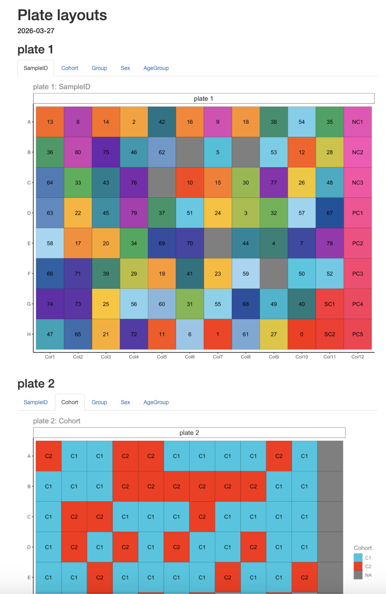

<!-- README.md is generated from README.Rmd. Please edit that file -->

```{r, include = FALSE}
knitr::opts_chunk$set(
  collapse = TRUE,
  comment = "#>",
  fig.path = "man/figures/README-",
  out.width = "100%"
)
```

# easyplater

<!-- badges: start -->
<!-- badges: end -->

easyplater is a tool for generating microplate manifests while decoupling clinical data from plate location effects.

In short, easyplater is an easy to use algorithm for generating 96-well plate designs without confounding clinical variables with plate location effects. Simply input clinical data and user-assigned clinical variable weights, and easyplater outputs the most deconvolved plate design it finds in plain text and R Markdown formats.

## Installation

You can install the development version of `easyplater` from [GitHub](https://github.com/) with:

```{r, eval=FALSE}
# install.packages("remotes")
remotes::install_github("IMCM-OX/easyplater")
```

## Example usage

```{r example, warnings=FALSE}
library(easyplater)
```

An example input manifest data frame comes loaded with easyplater.
```{r}
input_manifest
```

You can run easyplater on a multi-plate manifest data frame in one step.
```{r}
easyplater_manifest <- make_easyplater_design(
  manifest_df = input_manifest,
  columns_for_scoring = c("Cohort","Group","Sex","AgeGroup"),
  column_weights = c(5, 5, 10, 4),
  cols_to_categorize = list(c("Age", 10, "AgeGroup")),
  plate_size = 96
)
```

The output is a tibble with the plate locations deconvolved from the `columns_for_scoring`.
```{r}
easyplater_manifest
```

We can write the resulting manifest and plate layouts to an excel spreadsheet.
```{r}
write_manifest_excel(easyplater_manifest, "easyplater_output.xlsx")
```

```{r, include=FALSE}
file.remove("easyplater_output.xlsx")
```

## Visualizing outputs

We can then use a function exported from the OlinkAnalyze package to display a single plate layout...
```{r, warning=FALSE}
## Subset manifest to a single plate.
plate1_manifest <- easyplater_manifest[easyplater_manifest$plate == "plate 1",]
## Plot plate layout
olink_displayPlateLayout(data = plate1_manifest, fill.color = "Group", include.label = TRUE)
```

or generate an interactive html report of plate layouts colored by deconvolved variables
```{r, eval=FALSE, fig.width=3, fig.height=6}
write_plate_layout_html(easyplater_manifest)
```



## Troubleshooting

```{r}
# An example input manifest data frame comes loaded with easyplater
input_manifest

# Note also that an output manifest data frame also comes loaded with easyplater, which should be identical to the output from make_easyplater_design() above.
output_manifest
```
