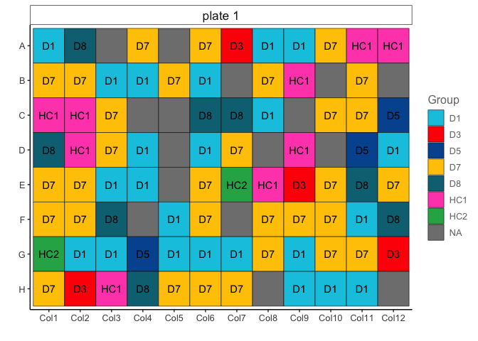
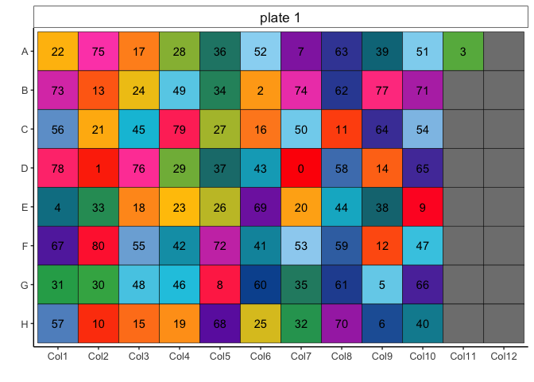
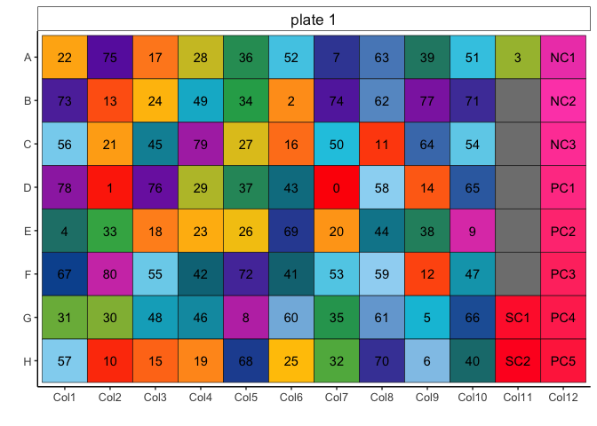
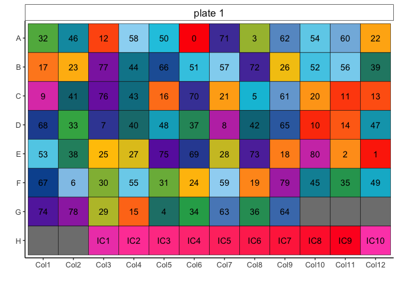

<!-- README.md is generated from README.Rmd. Please edit that file -->

# easyplater

<!-- badges: start -->

<!-- badges: end -->

`easyplater` is a tool for generating microplate manifests while
decoupling clinical data from plate location effects.

In short, `easyplater` is an easy to use algorithm for generating
96-well plate designs without confounding clinical variables with plate
location effects. Simply input clinical data and user-assigned clinical
variable weights, and easyplater outputs the most deconvolved plate
design it finds in plain text and R Markdown formats.

## Installation

You can install the development version of `easyplater` from
[GitHub](https://github.com/) with:

``` r
# install.packages("remotes")
remotes::install_github("IMCM-OX/easyplater")
```

## Example usage

``` r
library(easyplater)
library(dplyr)
library(ggplot2)
```

An example input manifest data frame comes loaded with easyplater.

``` r
input_manifest
#> # A tibble: 167 × 6
#>    SampleID Cohort Group   Sex   Age plate  
#>       <dbl> <chr>  <chr> <dbl> <dbl> <chr>  
#>  1        0 C2     D5        2    43 plate 1
#>  2        1 C1     D7        1    66 plate 1
#>  3        2 C1     D7        1    68 plate 1
#>  4        3 C2     D7        2    77 plate 1
#>  5        4 C1     D1        2    54 plate 1
#>  6        5 C1     D7        2    75 plate 1
#>  7        6 C2     D1        2    65 plate 1
#>  8        7 C2     D7        1    58 plate 1
#>  9        8 C2     D1        2    67 plate 1
#> 10        9 C2     D8        2    61 plate 1
#> # ℹ 157 more rows
```

There are three requirements for this data frame: - It must contain a
`SampleID` column. - Any columns used for randomization should be
categorical and should not have more than 5-10 unique values. - There
must be a column indicating the plate ID for each sample (default:
`plate`).

If a randomization column is numeric, it should be cut into discrete
categories, for example, using the `cut_interval()` function from the
`ggplot2` package:

``` r
input_manifest_cut <- input_manifest |> 
  mutate(AgeGroup = cut_interval(Age, 10),
         .by = plate)
```

You can run easyplater on a multi-plate manifest data frame in one step.

``` r
easyplater_manifest <- make_easyplater_design(
  manifest_df = input_manifest_cut,
  columns_for_scoring = c("Cohort","Group","Sex","AgeGroup"),
  column_weights = c(5, 5, 10, 4)
)
#> [1] "[:::] plate 1 [:::]"
#> [1] "Getting and formatting plate data from manifest."
#> [1] "Allocating similar samples to distal wells."
#> [1] "Performing sample switching search."
#> [1] "Storing the easyplater plate design in a data frame."
#> [1] "[:::] plate 2 [:::]"
#> [1] "Getting and formatting plate data from manifest."
#> [1] "Allocating similar samples to distal wells."
#> [1] "Performing sample switching search."
#> [1] "Storing the easyplater plate design in a data frame."
```

The output is a tibble with the plate locations deconvolved from the
`columns_for_scoring`.

``` r
easyplater_manifest
#> # A tibble: 192 × 9
#>    SampleID Cohort Group Sex   AgeGroup plate   column   row   well 
#>    <chr>    <chr>  <chr> <chr> <chr>    <chr>   <chr>    <chr> <chr>
#>  1 29       C1     D1    1     (62,67]  plate 1 Column 1 A     A1   
#>  2 10       C2     D7    2     <NA>     plate 1 Column 1 B     B1   
#>  3 15       C1     HC1   2     (77,82]  plate 1 Column 1 C     C1   
#>  4 36       C1     D8    1     (72,77]  plate 1 Column 1 D     D1   
#>  5 63       C2     D7    2     (67,72]  plate 1 Column 1 E     E1   
#>  6 5        C1     D7    2     (72,77]  plate 1 Column 1 F     F1   
#>  7 64       C1     HC2   1     (72,77]  plate 1 Column 1 G     G1   
#>  8 33       C1     D7    2     (47,52]  plate 1 Column 1 H     H1   
#>  9 62       C2     D8    1     (62,67]  plate 1 Column 2 A     A2   
#> 10 11       C2     D7    2     (72,77]  plate 1 Column 2 B     B2   
#> # ℹ 182 more rows
```

We can write the resulting manifest and plate layouts to an excel
spreadsheet.

``` r
write_manifest_excel(easyplater_manifest, "easyplater_output.xlsx")
```

## Visualizing outputs

We can then use a function exported from the OlinkAnalyze package to
display a single plate layout…

``` r
## Subset manifest to a single plate.
plate1_manifest <- easyplater_manifest[easyplater_manifest$plate == "plate 1",]
## Plot plate layout
olink_displayPlateLayout(data = plate1_manifest, fill.color = "Group", include.label = TRUE)
```



or generate an interactive html report of plate layouts colored by
deconvolved variables

``` r
write_plate_layout_html(easyplater_manifest)
```


## Reserving specific wells

Often, we need to reserve specific well locations for technical samples,
such as internal controls, samples for bridging across plates, or empty
wells. This can been achieved by running `allocate_fixed_wells()`.

We can group all the empty wells at one end of the plate:

``` r
plate1 <- input_manifest_cut |> filter(plate == "plate 1")

fixed_wells <- assign_fixed_wells(plate1)

easyplater_manifest <- make_easyplater_design(
  manifest_df = plate1,
  columns_for_scoring = c("Cohort","Group","Sex","AgeGroup"),
  column_weights = c(5, 5, 10, 4),
  fixed_wells = fixed_wells
)
#> [1] "[:::] plate 1 [:::]"
#> [1] "Getting and formatting plate data from manifest."
#> [1] "Allocating similar samples to distal wells."
#> [1] "Performing sample switching search."
#> [1] "Storing the easyplater plate design in a data frame."

easyplater_manifest |>
  olink_displayPlateLayout(fill.color = "SampleID", include.label = TRUE) +
  theme(legend.position = "none")
```



We can also provide a vector of wells we want to reserve and label.

For example, for the Olink Explore HT platform, there are 10 technical
controls that go in the final 10 wells when filled column-wise:

``` r
fixed_idcs <- 87:96
fixed_labs <- c(paste0("SC", 1:2), paste0("NC", 1:3), paste0("PC", 1:5))
fixed_wells <- assign_fixed_wells(plate1, fixed_idcs, fixed_labs)

easyplater_manifest <- make_easyplater_design(
  manifest_df = plate1,
  columns_for_scoring = c("Cohort","Group","Sex","AgeGroup"),
  column_weights = c(5, 5, 10, 4),
  fixed_wells = fixed_wells
)
#> [1] "[:::] plate 1 [:::]"
#> [1] "Getting and formatting plate data from manifest."
#> [1] "Allocating similar samples to distal wells."
#> [1] "Performing sample switching search."
#> [1] "Storing the easyplater plate design in a data frame."

easyplater_manifest |>
  olink_displayPlateLayout(fill.color = "SampleID", include.label = TRUE) +
  theme(legend.position = "none")
```



Whereas the Alamar NULISAseq platform places 10 technical controls in
the final 10 well when filled row-wise:

``` r
fixed_idcs <- (3:12)*8
fixed_labs <- paste0("IC", 1:10)
fixed_wells <- assign_fixed_wells(plate1, fixed_idcs, fixed_labs, 
                                  fill_rowwise = TRUE)

easyplater_manifest <- make_easyplater_design(
  manifest_df = plate1,
  columns_for_scoring = c("Cohort","Group","Sex","AgeGroup"),
  column_weights = c(5, 5, 10, 4),
  fixed_wells = fixed_wells
)
#> [1] "[:::] plate 1 [:::]"
#> [1] "Getting and formatting plate data from manifest."
#> [1] "Allocating similar samples to distal wells."
#> [1] "Performing sample switching search."
#> [1] "Storing the easyplater plate design in a data frame."

easyplater_manifest |>
  olink_displayPlateLayout(fill.color = "SampleID", include.label = TRUE) +
  theme(legend.position = "none")
```



## Troubleshooting

``` r
# An example input manifest data frame comes loaded with easyplater
input_manifest
#> # A tibble: 167 × 6
#>    SampleID Cohort Group   Sex   Age plate  
#>       <dbl> <chr>  <chr> <dbl> <dbl> <chr>  
#>  1        0 C2     D5        2    43 plate 1
#>  2        1 C1     D7        1    66 plate 1
#>  3        2 C1     D7        1    68 plate 1
#>  4        3 C2     D7        2    77 plate 1
#>  5        4 C1     D1        2    54 plate 1
#>  6        5 C1     D7        2    75 plate 1
#>  7        6 C2     D1        2    65 plate 1
#>  8        7 C2     D7        1    58 plate 1
#>  9        8 C2     D1        2    67 plate 1
#> 10        9 C2     D8        2    61 plate 1
#> # ℹ 157 more rows

# Note also that an output manifest data frame also comes loaded with easyplater, which should be identical to the output from make_easyplater_design() above.
output_manifest
#> # A tibble: 192 × 9
#>    SampleID Cohort Group Sex   AgeGroup plate   column   row   well 
#>    <chr>    <chr>  <chr> <chr> <chr>    <chr>   <chr>    <chr> <chr>
#>  1 13       C1     D1    2     9        plate 1 Column 1 A     A1   
#>  2 36       C1     D8    1     9        plate 1 Column 1 B     B1   
#>  3 64       C1     HC2   1     9        plate 1 Column 1 C     C1   
#>  4 63       C2     D7    2     8        plate 1 Column 1 D     D1   
#>  5 58       C1     D7    2     9        plate 1 Column 1 E     E1   
#>  6 66       C2     D8    2     9        plate 1 Column 1 F     F1   
#>  7 74       C1     D1    2     7        plate 1 Column 1 G     G1   
#>  8 47       C1     HC1   1     6        plate 1 Column 1 H     H1   
#>  9 8        C2     D1    2     7        plate 1 Column 2 A     A2   
#> 10 80       C2     HC1   2     6        plate 1 Column 2 B     B2   
#> # ℹ 182 more rows
```
