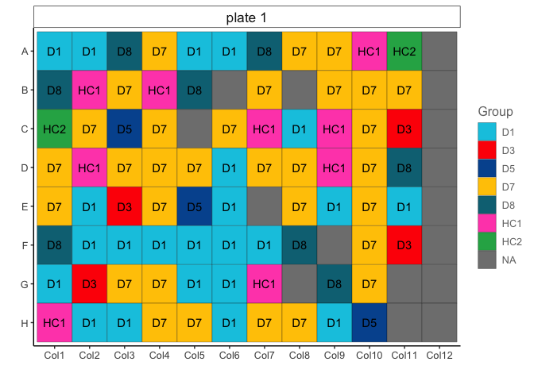

<!-- README.md is generated from README.Rmd. Please edit that file -->

# easyplater

<!-- badges: start -->

<!-- badges: end -->

easyplater is a tool for generating microplate manifests while
decoupling clinical data from plate location effects.

In short, easyplater is an easy to use algorithm for generating 96-well
plate designs without confounding clinical variables with plate location
effects. Simply input clinical data and user-assigned clinical variable
weights, and easyplater outputs the most deconvolved plate design it
finds in plain text and R Markdown formats.

## Installation

You can install the development version of `easyplater` from
[GitHub](https://github.com/) with:

``` r
# install.packages("remotes")
remotes::install_github("IMCM-OX/easyplater")
```

## Example usage

``` r
library(easyplater)
```

An example input manifest data frame comes loaded with easyplater.

``` r
input_manifest
#> # A tibble: 423 × 9
#>    SampleID Cohort Group   Sex   Age plate   column   row   well 
#>       <dbl> <chr>  <chr> <dbl> <dbl> <chr>   <chr>    <chr> <chr>
#>  1        0 C2     D5        2    43 plate 1 Column 1 A     A1   
#>  2        1 C1     D7        1    66 plate 1 Column 1 B     B1   
#>  3        2 C1     D7        1    68 plate 1 Column 1 C     C1   
#>  4        3 C2     D7        2    77 plate 1 Column 1 D     D1   
#>  5        4 C1     D1        2    54 plate 1 Column 1 E     E1   
#>  6        5 C1     D7        2    75 plate 1 Column 1 F     F1   
#>  7        6 C2     D1        2    65 plate 1 Column 1 G     G1   
#>  8        7 C2     D7        1    58 plate 1 Column 1 H     H1   
#>  9        8 C2     D1        2    67 plate 1 Column 2 A     A2   
#> 10        9 C2     D8        2    61 plate 1 Column 2 B     B2   
#> # ℹ 413 more rows
```

You can run easyplater on a multi-plate manifest data frame in one step.

``` r
easyplater_manifest <- make_easyplater_design(
  manifest_df = input_manifest,
  columns_for_scoring = c("Cohort","Group","Sex","AgeGroup"),
  column_weights = c(5, 5, 10, 4),
  cols_to_categorize = list(c("Age", 10, NULL, "AgeGroup")),
  plate_size = 96
)
#> [1] "[:::] plate 1 [:::]"
#> [1] "Getting and formatting plate data from manifest."
#> [1] "Allocating similar samples to distal wells."
#> [1] "Performing sample switching search."
#> [1] "Storing the easyplater plate design in a data frame."
#> [1] "[:::] plate 2 [:::]"
#> [1] "Getting and formatting plate data from manifest."
#> [1] "Allocating similar samples to distal wells."
#> [1] "Performing sample switching search."
#> [1] "Storing the easyplater plate design in a data frame."
#> [1] "[:::] plate 3 [:::]"
#> [1] "Getting and formatting plate data from manifest."
#> [1] "Allocating similar samples to distal wells."
#> [1] "Performing sample switching search."
#> [1] "Storing the easyplater plate design in a data frame."
#> [1] "[:::] plate 4 [:::]"
#> [1] "Getting and formatting plate data from manifest."
#> [1] "Allocating similar samples to distal wells."
#> [1] "Performing sample switching search."
#> [1] "Storing the easyplater plate design in a data frame."
#> [1] "[:::] plate 5 [:::]"
#> [1] "Getting and formatting plate data from manifest."
#> [1] "Allocating similar samples to distal wells."
#> [1] "Performing sample switching search."
#> [1] "Storing the easyplater plate design in a data frame."
```

The output is a tibble with the plate locations deconvolved from the
`columns_for_scoring`.

``` r
easyplater_manifest
#> # A tibble: 480 × 9
#>    SampleID Cohort Group Sex   AgeGroup plate   column   row   well 
#>    <chr>    <chr>  <chr> <chr> <chr>    <chr>   <chr>    <chr> <chr>
#>  1 13       C1     D1    2     9        plate 1 Column 1 A     A1   
#>  2 36       C1     D8    1     9        plate 1 Column 1 B     B1   
#>  3 64       C1     HC2   1     9        plate 1 Column 1 C     C1   
#>  4 63       C2     D7    2     8        plate 1 Column 1 D     D1   
#>  5 58       C1     D7    2     9        plate 1 Column 1 E     E1   
#>  6 66       C2     D8    2     9        plate 1 Column 1 F     F1   
#>  7 74       C1     D1    2     7        plate 1 Column 1 G     G1   
#>  8 47       C1     HC1   1     6        plate 1 Column 1 H     H1   
#>  9 8        C2     D1    2     7        plate 1 Column 2 A     A2   
#> 10 80       C2     HC1   2     6        plate 1 Column 2 B     B2   
#> # ℹ 470 more rows
```

We can write the resulting manifest and plate layouts to an excel
spreadsheet.

``` r
write_manifest_excel(easyplater_manifest, "easyplater_output.xlsx")
```

## Visualizing outputs

We can then use a function exported from the OlinkAnalyze package to
display a single plate layout…

``` r
## Subset manifest to a single plate.
plate1_manifest <- easyplater_manifest[easyplater_manifest$plate == "plate 1",]
## Plot plate layout
olink_displayPlateLayout(data = plate1_manifest, fill.color = "Group", include.label = TRUE)
```



or generate an interactive html report of plate layouts colored by
deconvolved variables

``` r
write_plate_layout_html(easyplater_manifest)
```


## Troubleshooting

``` r
# An example input manifest data frame comes loaded with easyplater
input_manifest
#> # A tibble: 423 × 9
#>    SampleID Cohort Group   Sex   Age plate   column   row   well 
#>       <dbl> <chr>  <chr> <dbl> <dbl> <chr>   <chr>    <chr> <chr>
#>  1        0 C2     D5        2    43 plate 1 Column 1 A     A1   
#>  2        1 C1     D7        1    66 plate 1 Column 1 B     B1   
#>  3        2 C1     D7        1    68 plate 1 Column 1 C     C1   
#>  4        3 C2     D7        2    77 plate 1 Column 1 D     D1   
#>  5        4 C1     D1        2    54 plate 1 Column 1 E     E1   
#>  6        5 C1     D7        2    75 plate 1 Column 1 F     F1   
#>  7        6 C2     D1        2    65 plate 1 Column 1 G     G1   
#>  8        7 C2     D7        1    58 plate 1 Column 1 H     H1   
#>  9        8 C2     D1        2    67 plate 1 Column 2 A     A2   
#> 10        9 C2     D8        2    61 plate 1 Column 2 B     B2   
#> # ℹ 413 more rows

# Note also that an output manifest data frame also comes loaded with easyplater, which should be identical to the output from make_easyplater_design() above.
output_manifest
#> # A tibble: 480 × 9
#>    SampleID Cohort Group Sex   AgeGroup plate   column   row   well 
#>    <chr>    <chr>  <chr> <chr> <chr>    <chr>   <chr>    <chr> <chr>
#>  1 13       C1     D1    2     9        plate 1 Column 1 A     A1   
#>  2 36       C1     D8    1     9        plate 1 Column 1 B     B1   
#>  3 64       C1     HC2   1     9        plate 1 Column 1 C     C1   
#>  4 63       C2     D7    2     8        plate 1 Column 1 D     D1   
#>  5 58       C1     D7    2     9        plate 1 Column 1 E     E1   
#>  6 66       C2     D8    2     9        plate 1 Column 1 F     F1   
#>  7 74       C1     D1    2     7        plate 1 Column 1 G     G1   
#>  8 47       C1     HC1   1     6        plate 1 Column 1 H     H1   
#>  9 8        C2     D1    2     7        plate 1 Column 2 A     A2   
#> 10 80       C2     HC1   2     6        plate 1 Column 2 B     B2   
#> # ℹ 470 more rows
```
